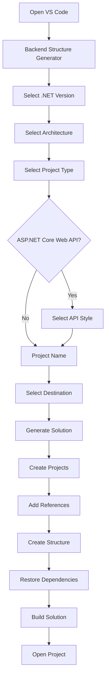
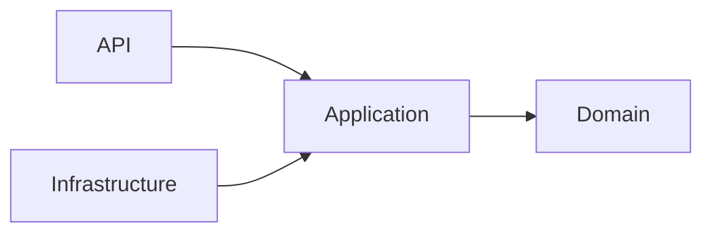
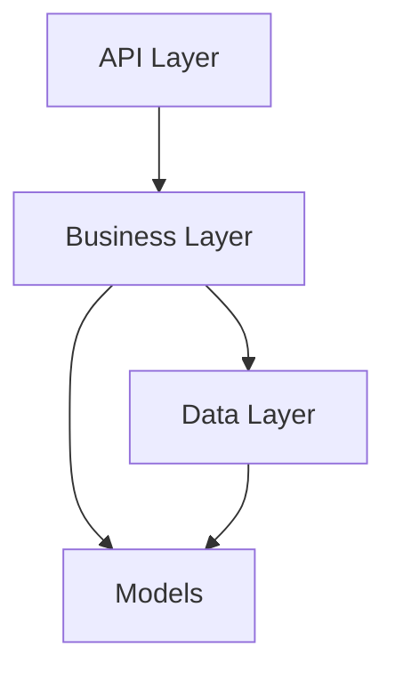
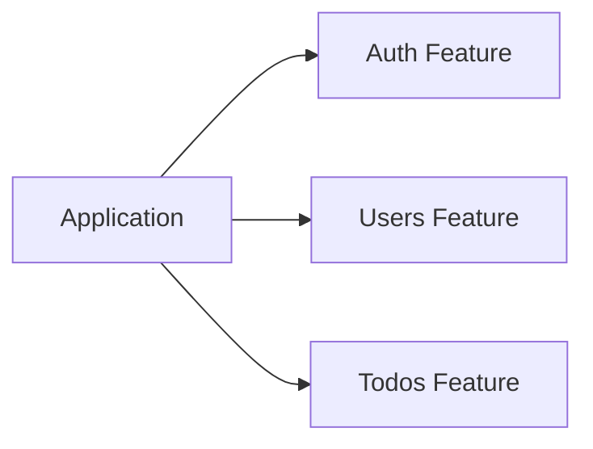
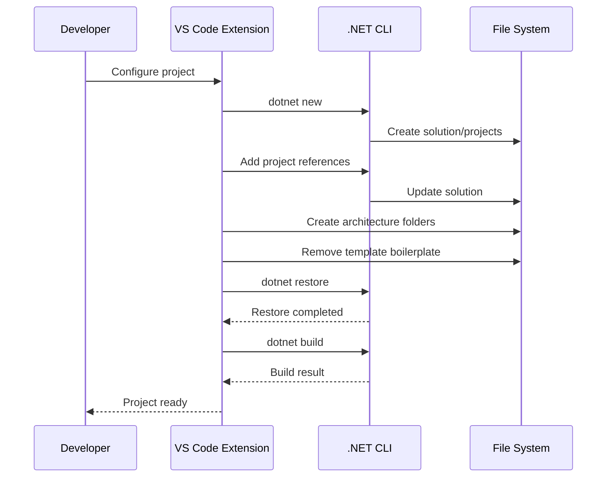

<div align="center">

# ⚡ Backend Structure Generator

### Generate clean, scalable backend project structures directly from Visual Studio Code.

A developer-focused scaffolding extension that turns repetitive backend setup into a guided workflow — from architecture selection to a ready-to-build .NET solution.

<p>
  
  
  
  
</p>

<p>
  <strong>Choose your stack → Choose your architecture → Generate → Start coding.</strong>
</p>

</div>

---

## 🎯 The Problem

Starting a backend project should not mean spending the first 15–30 minutes repeatedly creating the same folders, projects, references, and boilerplate.

Backend Structure Generator automates that setup while keeping the generated solution understandable and under the developer's control.

Instead of:

```text
Create solution
    ↓
Create projects
    ↓
Create folders
    ↓
Add project references
    ↓
Choose API style
    ↓
Remove template boilerplate
    ↓
Restore dependencies
    ↓
Build
```

You get:

```text
┌───────────────────────────────┐
│  Backend Structure Generator  │
├───────────────────────────────┤
│ .NET Version                  │
│ Architecture                  │
│ Project Type                 │
│ API Style                    │
│ Project Name                 │
│ Destination                  │
└───────────────┬───────────────┘
                │
                ▼
        🚀 Generate Project
                │
                ▼
      Ready-to-build solution
```

---

# ✨ Features

- 🧙 **Interactive project wizard**
- ⚙️ **.NET 8, 9 and 10 support**
- 🏗️ **Simple / Folder-Based architecture**
- 🧱 **Clean Architecture**
- 📚 **N-Layered Architecture**
- 🔪 **Vertical Slice Architecture**
- 🌐 **ASP.NET Core Web API**
- ⚡ **Minimal API support**
- 🎮 **Controllers support**
- 🔄 **Worker Service projects**
- 🖥️ **Console Application projects**
- 🔗 **Automatic project references**
- 🧹 **Automatic removal of template boilerplate**
- 📦 **Automatic restore**
- 🏗️ **Automatic solution build**
- 📖 **Generated project README**
- ⌨️ **Command Palette + keyboard shortcut**
- 📂 **Open generated project directly in VS Code**

---

# 🧭 How It Works



> The extension uses the official .NET CLI to create real projects instead of generating a collection of disconnected empty folders.

---

# 🏗️ Architecture Options

## 1. Simple / Folder-Based

The pragmatic option for small and medium-sized applications where introducing multiple projects would add unnecessary complexity.

### Controllers

```text
TodoApi
└── src
    └── TodoApi.Api
        ├── Controllers
        ├── Models
        ├── Services
        ├── Data
        ├── Middleware
        ├── Extensions
        └── Helpers
```

### Minimal API

```text
TodoApi
└── src
    └── TodoApi.Api
        ├── Endpoints
        ├── Models
        ├── Services
        ├── Data
        ├── Middleware
        ├── Extensions
        └── Helpers
```

---

## 2. Clean Architecture

Separates business rules from infrastructure and delivery concerns.

```text
TodoApi
├── src
│   ├── TodoApi.Api
│   ├── TodoApi.Application
│   ├── TodoApi.Domain
│   └── TodoApi.Infrastructure
│
└── TodoApi.sln / TodoApi.slnx
```

### Dependency direction



The core domain remains independent from external infrastructure concerns.

---

## 3. N-Layered Architecture

A classic approach that makes application responsibilities explicit.

```text
TodoApi
├── src
│   ├── TodoApi.Api
│   ├── TodoApi.Business
│   ├── TodoApi.Data
│   └── TodoApi.Models
│
└── TodoApi.sln / TodoApi.slnx
```

Typical responsibility flow:



---

## 4. Vertical Slice Architecture

Organizes code around business capabilities rather than forcing every feature across the same technical folders.

```text
TodoApi
└── src
    └── TodoApi.Api
        ├── Features
        │   ├── Auth
        │   ├── Users
        │   └── Todos
        ├── Middleware
        ├── Extensions
        └── Helpers
```

Conceptually:



---

# 🌐 API Styles

For ASP.NET Core Web API projects, choose the style that matches your application.

| API Style | Structure | Best For |
|---|---|---|
| 🎮 Controllers | `Controllers/` | Traditional REST APIs and teams familiar with MVC-style organization |
| ⚡ Minimal API | `Endpoints/` | Lightweight APIs, smaller services and modern endpoint-focused applications |

---

# 📦 Project Types

| Project Type | Status |
|---|---|
| ASP.NET Core Web API | ✅ Supported |
| Worker Service | ✅ Supported |
| Console Application | ✅ Supported |

---

# 🚀 Quick Start

## Requirements

Before generating a project, install:

- Visual Studio Code
- .NET SDK
- Node.js + npm — required when developing the extension itself

Verify .NET:

```bash
dotnet --version
```

---

## Generate a project

Open the Command Palette:

```text
Ctrl + Shift + P
```

Search for:

```text
Backend Structure Generator: Generate
```

Or use the shortcut:

```text
Ctrl + Alt + B
```

Then follow the wizard:

```text
.NET Version
      ↓
Architecture
      ↓
Project Type
      ↓
API Style
      ↓
Project Name
      ↓
Destination
      ↓
🚀 Generate
```

---

# 🧪 Example

Imagine you're starting a Todo API.

Select:

```text
.NET Version     → .NET 10
Architecture     → Simple / Folder-Based
Project Type     → ASP.NET Core Web API
API Style        → Minimal API
Project Name     → TodoApi
```

The extension generates:

```text
TodoApi
├── src
│   └── TodoApi.Api
│       ├── Endpoints
│       ├── Models
│       ├── Services
│       ├── Data
│       ├── Middleware
│       ├── Extensions
│       └── Helpers
│
├── README.md
└── TodoApi.slnx
```

The generated solution is restored and built automatically.

---

# 🔬 Under the Hood

The generator is intentionally built around the .NET CLI rather than trying to reinvent project creation.



This keeps the generated projects compatible with normal .NET development workflows.

---

# 🧠 Design Philosophy

### Keep setup boring.

Project initialization is infrastructure, not the product.

### Prefer the simplest architecture that fits.

Clean Architecture is useful. So is a single project with sensible folders. The extension gives developers the choice instead of forcing one philosophy onto every project.

### Generate real projects.

The output should behave like a project created manually with the official tooling.

### Don't hide the structure.

Generated code should remain understandable and easy to change after the generator finishes.

### Automate repetition, not decisions.

The extension automates mechanical work while the developer remains responsible for architectural decisions.

---

# 🗺️ Roadmap

The project starts with a focused .NET experience and is designed to evolve into a broader backend scaffolding platform.

## Phase 1 — .NET Foundation

- [x] .NET 8
- [x] .NET 9
- [x] .NET 10
- [x] Simple / Folder-Based
- [x] Clean Architecture
- [x] N-Layered Architecture
- [x] Vertical Slice Architecture
- [x] Controllers
- [x] Minimal APIs
- [x] Web API
- [x] Worker Service
- [x] Console Application
- [x] Automatic restore
- [x] Automatic build
- [x] Generated README

## Phase 2 — More Languages

Planned language support:

```text
                Backend Structure Generator
                           │
          ┌────────────────┼────────────────┐
          ▼                ▼                ▼
         C#           TypeScript          Python
          │                │                │
          ▼                ▼                ▼
       .NET          Node.js / NestJS    FastAPI / Django
          │                │                │
          └────────────────┼────────────────┘
                           ▼
                     Architecture
                           │
              ┌────────────┼────────────┐
              ▼            ▼            ▼
           Simple        Clean       Layered
```

Future candidates include:

- [ ] TypeScript / Node.js
- [ ] Python
- [ ] Java
- [ ] Go
- [ ] More frameworks and ecosystem-specific templates

---

# 🔮 Future Vision

The long-term goal is to make project scaffolding **language-aware, framework-aware and architecture-aware**.

A future workflow could look like:

```text
Language
   ↓
Framework
   ↓
Architecture
   ↓
Project Type
   ↓
Database
   ↓
Authentication
   ↓
Testing
   ↓
Docker
   ↓
CI/CD
   ↓
🚀 Generate
```

Potential future capabilities include:

### 🗄️ Database Templates

Optional setup for technologies such as SQL Server, PostgreSQL, MySQL and MongoDB.

### 🔐 Authentication Templates

Optional authentication foundations such as JWT, OAuth and role-based authorization.

### 📚 API Documentation

Optional OpenAPI, Swagger or Scalar setup.

### 🧪 Testing

Generate unit/integration test projects with the appropriate framework for the selected language.

### 🐳 Docker

Generate Dockerfiles, Compose configuration and development containers when requested.

### ⚙️ CI/CD

Generate starter GitHub Actions workflows for build, test and deployment pipelines.

### 🎨 Custom Templates

Allow teams to define reusable organization-specific templates and conventions.

---

# 📊 Feature Matrix

| Capability | Current | Future |
|---|:---:|:---:|
| .NET 8 / 9 / 10 | ✅ | — |
| Simple Architecture | ✅ | — |
| Clean Architecture | ✅ | — |
| N-Layered Architecture | ✅ | — |
| Vertical Slice | ✅ | — |
| Controllers | ✅ | — |
| Minimal APIs | ✅ | — |
| Worker Services | ✅ | — |
| Console Applications | ✅ | — |
| TypeScript | — | 🔜 |
| Python | — | 🔜 |
| Java | — | 🔜 |
| Go | — | 🔜 |
| Database Templates | — | 🔜 |
| Authentication Templates | — | 🔜 |
| Docker Generation | — | 🔜 |
| CI/CD Generation | — | 🔜 |
| Custom Templates | — | 🔜 |

---

# 🛠️ Development

Clone the repository and install dependencies:

```bash
git clone https://github.com/mohammedhany4213-create/backend-.net-structure-generator-vs-code-extension-.git
cd backend-.net-structure-generator-vs-code-extension-
npm install
```

Compile the extension:

```bash
npm run compile
```

Run the extension locally:

1. Open the repository in VS Code.
2. Press `F5`.
3. A new Extension Development Host window opens.
4. Run `Backend Structure Generator: Generate`.

Run linting:

```bash
npm run lint
```

---

# 🤝 Contributing

Contributions are welcome.

If you want to contribute a new architecture, language, framework or generator capability, open an issue first when the change is substantial. This helps keep the generator's architecture coherent as the project grows.

A good contribution should aim to be:

- Focused
- Maintainable
- Consistent with existing generators
- Easy for developers to understand
- Built around the official tooling of the target ecosystem

> **Automate repetition. Preserve developer control.**

---

# 🐛 Issues & Feature Requests

Found a bug or have an idea?

When opening an issue, include:

1. VS Code version
2. .NET SDK version
3. Selected architecture
4. Selected project type
5. API style, if applicable
6. Expected behavior
7. Actual behavior
8. Relevant error output

---

# 📌 Current Status

> 🚧 **Active Development**

The project is currently focused on building a solid .NET foundation before expanding into additional languages and frameworks.

The architecture is intentionally kept modular so future generators can be added without rewriting the entire extension.

---

# ⭐ Support

If this project saves you time, consider giving it a ⭐ on GitHub.

Feature requests, bug reports and contributions are also highly appreciated.

---

<div align="center">

### ⚡ Start with structure. Build with confidence.

**Backend Structure Generator**

Made for developers who would rather build features than create folders.

</div>
